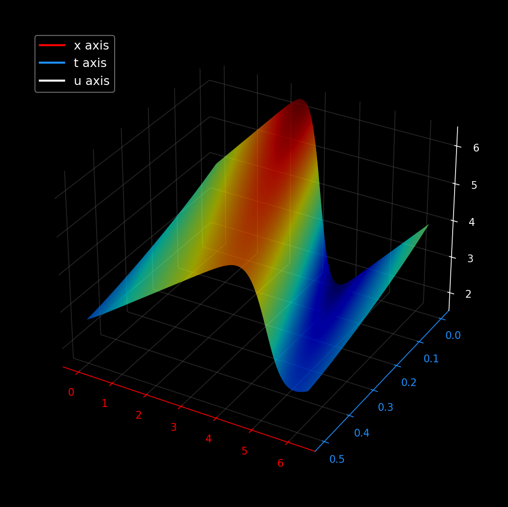
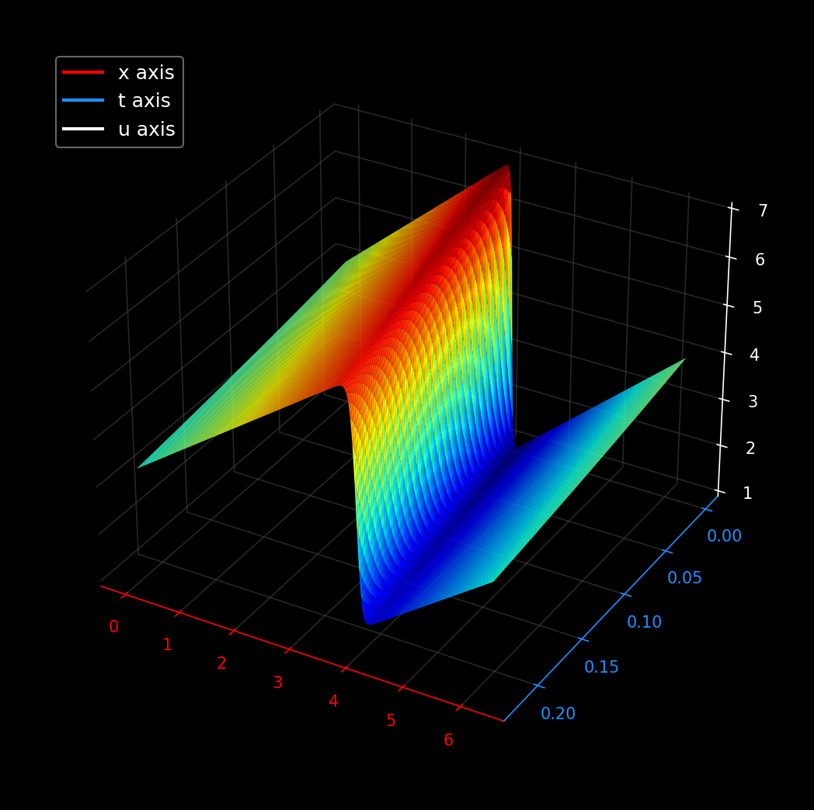
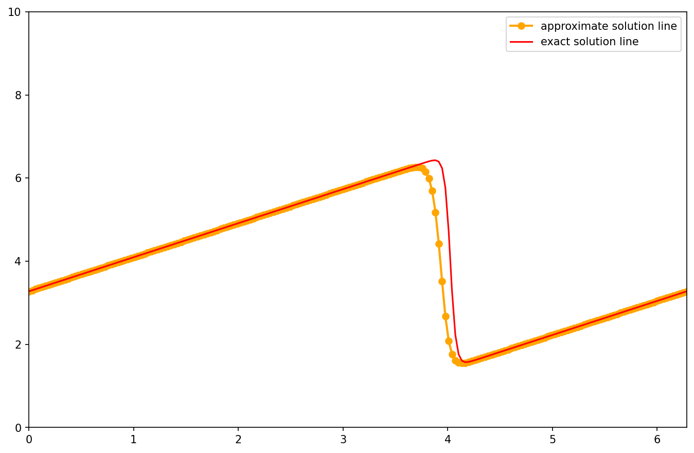

# 1D Viscous Burgers' Equation Simulation

Simulating 1D viscous Burgers' equation in python using finite differences, then plotting it against the exact solution to see how well the math holds up.

# Visualizations

<p align="center">
  
  <br>
  <em>Figure 1: A Smooth 3D surface plot of the Burgers' equation solution field u(x,t) for ν = 0.5 and Nx = 400.</em>
</p>

<p align="center">
  
  <br>
  <em>Figure 2: 3D evolution of u(x,t) showing non linear wave steepening into a sharp viscous shock ν = 0.07.</em>
</p>

<br>

<p align="center">
  
  <br>
  <em>Figure 3: Validation of the finite difference solver against the analytical solution via Cole-Hopf. </em>
</p>


## Overview


Burgers' equation combines two main physics behaviors: non linear convection (wave steepening) and diffusion (smoothing out gradients). 

* **Numerical Model:** I used a 1st order upwind scheme for the advection term $u \frac{\partial u}{\partial x}$ and a 2nd order central difference for the viscosity term $\nu \frac{\partial^2 u}{\partial x^2}$ with periodic boundaries.
* **Cole-Hopf?** Non linear PDEs are unusually hard to solve analytically. So using cole-hopf transformation converts the burgers' into a linear heat equation, which happens to have a known exact solution!!. Then Using `sympy` to handle that transformation gives a clean ground truth solution to check the finite difference code against.

## Grid Convergence Study
## Grid Convergence Study

I Ran a 3 grid GCI check (N = 400, 200, 100) on the higher viscosity solver (`burgers_higher_viscosity_simulation.py`, ν = 0.5) to check if the solver is actually converging the way it should.

​```
Fine Mesh   (N1=400):  phi1 = 4.091412
Medium Mesh (N2=200):  phi2 = 4.075574
Coarse Mesh (N3=100):  phi3 = 4.046253

Order of Convergence (p): 0.8854
Extrapolated Limit:       4.110015
Fine Grid GCI:          0.5684%
​```

p ≈ 0.89, close to 1st order. Makes sense since advection is upwind (1st order), diffusion is central (2nd order), so the lower-order term dominates the overall error. GCI on the finest grid is under 1%.
## Setup & Running

```bash
pip install numpy sympy matplotlib
python burgers_simulation.py                         # ν=0.07 shock case
python burgers_higher_viscosity_simulation.py         # ν=0.5, includes GCI convergence study
